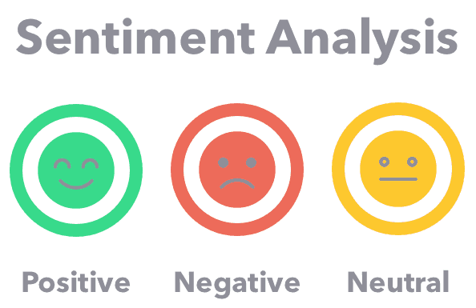
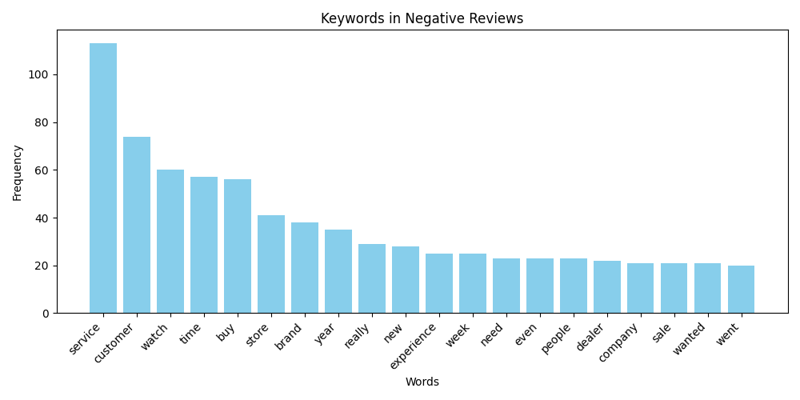

# Customer Pain Points Detection using Sentiment Analysis


### A Machine Learning Project that gives Insights on Brand perception by the customers

One of the key points for a brand success is the customer satisfation on companies services or products. In fact, it may be the most impactful thing in business development in long term. When we have a small online business, it could be easy to determine what customer think about you, to promote your strongest points, and to solve your waekest points. Today we're focusing on these weakest points.

There are different companies that let customers vote and express their satisfaction (or the lack of it) with a specific brand. Between all this companies, there is one spacially relevant for the quantity of users that post consistently on their webpage, and this webpage is [Trustpilot](https://www.trustpilot.com/). The opinions posted on this website are usually consistent.

Today we are going to be using this website to get the reviews from a companies customer, then analyse the comments whether they are positive or negative (Sentiment analysis), and finally get the worst reviews and count relevant words that define the category of the review (price, experience, delivery,...).

For this project, we've chosen an spanish cycling online store, called [Siroko](https://www.siroko.com/es/). This is a well known company between the cycling community, and recently they have grown so much. 

Unfortunately, Siroko doesn't have great reviews on their[Trustpilot Page](https://www.trustpilot.com/review/www.siroko.com). 

. 

That's why it could be really interesting for them to analyse the reviews and try to understand the points where they should improve as a company.

To do this project, there's is three clear steps that we need to get the main pain points:

## Steps of the project

* Trustpilot scraping
* Sentiment Analysis on Reviews
* Relevant word counting and pain point determination


### Trustpilot Scraping 

This step requires to understant how the Trustpilot is structured. In this step, we're getting every review, and storing the information in [reviews.csv](data/reviews.csv). Every row on that csv file represents a review from a customer, and the information we're getting is:

- username
- Total reviews
- Location
- Date
- content

To get the trustpilot result, you need to run the [1_trustpilot_scrapping](scripts/1_trustpilot_scrapping.py) script.


### Sentiment Analysis on Reviews

What a sentiment analysis script does is to categorize text wether is positive or not.



But, why are we using this process, if we have the Trustpilot score just doing webscraping?

We know that sometimes comments don't match exactly with their score. There are optimistic people that had issues with our services, but gives us 4 out of 5 stars. Others may do the opposite. Taking this into account, we are going to analyze the reviews with 1 or 2 stars as score, or those with a negative score on sentiment anaylsis.

 To de this sentiment analysis, there are many libraries in python that gets different results. The one I've chosen is Textblob. This is a llibrary that is pretty easy to use compared to others, and gives us two scores on a specific text:

 - Polarity: Categorizes a comment whether is positive or not, being 1 the most positive text possible, and -1 the most negative one.
 - Subjectivity: Gives a score from 0 to 1, being 0 the most objective comment, and 1 the most 

The result is stored in [reviews_with_emotion_score](data/reviews_with_emotion_score.csv).


### Relevant word counting and pain point determination

As mentioned before, we can now take these reviews and count the words that appear on those reviews. Is almost impossible to remove all the irrelevant words on reviews. but after running the script we'll be able to determine the pain ponits of the company. We're doing this process with nltk library.

Without further ado, let's see the Top 20 words used in comments:



we can see some relevant words in this chart:

- experience
- customer
- return
- service
- product
- item
- quality

That seems to indicate that the main pain points in Siroko are related with the returning system, and product quality.


## Conclusions

We have seen how, from a huge amount of reviews to be analysed manually, we were able to get the main pain points of our customers. 

I strongly believe this is a super powerful tool for a huge variety of companies. I'll work on new versions of this code to make it even more reliable, and help companies get the best of their data!


### Generic solution

This scripts are made to analyse Siroko company, but you may need to analyse other companies. To do so, there's a script called [1_trustpilot_scrapping_generic](scripts/1_trustpilot_scrapping_generic.py), in which you can use different companies that are on Trustpilot. To do so, you need to determine the comany domain and the number of pages that the review have on Trustpilot, stored on [company](source/company.txt) and [number_of_review_pages](source/number_of_review_pages.txt), respectively. 

To get the top 20 negative words, you just need to run the script mentioned, and then the second and third scripts, as we did in the Siroko example.


## Project file Structure

- `data/`: Contains the Data generated from the scripts, "revies.csv" and "reviews_with_emotion_score.csv".
- `images/`: all the pictures used on the project
- `scripts/`: Contains the scripts to run the solution. Just to mention, the numbers indicates the order of execution of the scripts
- `source/`: the txt files to determine in order to run the generic script


## Installation

- Clone the repository with the following command:
```bash
git clone https://github.com/EnricGarciaMunoz/Brand_Perception_Sentiment_Analysis_Python
```

- Go to the project directory:

```bash
cd Brand_Perception_Sentiment_Analysis_Python
```

- Install the dependencies:
```bash
pip install pandas textblob nltk matplotlib
```

- Download the necessary NLTK data:
```bash
import nltk
nltk.download('punkt')
nltk.download('stopwords')
nltk.download('wordnet')
```


## Usage

We need to run the scripts in order

Run the Trustpilot scraping script:

```bash
python scripts/1_trustpilot_scraping.py
```
Run the Sentiment Analysis script:

```bash
python scripts/2_sentiment_analysis.py
```

Run the Word Counting script:

```bash
python scripts/3_word_counting.py
```

This will run the entire solution.


I hope you find this project interesting. I strongly encourage you to contact with me if you have any doubt. Thank you!