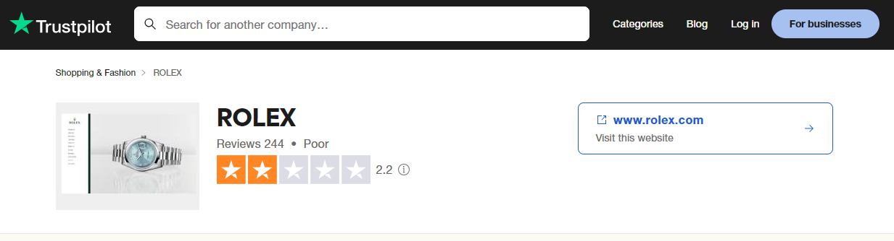

# Rolex Customer Pain Points Detection using Sentiment Analysis


### ML Project to analyze Rolex's key Success Drivers 

One of the key factors for a brand's success is customer satisfaction. When running a small online business, it can be relatively easy to determine what customers think about you, giving you the opportunity to address your weakest points. However, this task becomes much more challenging for a large company. Today, we are focusing on identifying these pain points in a major company like Rolex.

To understand what customers think about our brand, there are various methods: reviews, emails, customer service tickets, etc. However, nowadays, one website has gained significant reliability for reviewing brands: [Trustpilot](https://www.trustpilot.com/). The opinions posted on this site are generally consistent, and it has a large and highly engaged community.

Since this is one of the most relevant sources of information available, we will use this website to gather reviews from Rolex's previous customers.

The main goal of the project is to determine the primary reasons behind negative reviews. We will categorize the reviews as either good or bad, then count the relevant words to identify the most frequently used ones. This will help us identify the main pain points.

Unfortunately, Rolex doesn't have great reviews on its [Trustpilot Page](https://www.trustpilot.com/review/www.rolex.com). 

. 

That's why it could be very interesting to analyze the reviews and understand the areas where the company could improve.

To carry out this project, there are three clear steps we need to follow to identify the main pain points:

## Project Steps

* Trustpilot scraping
* Data Cleaning
* Sentiment Analysis of Reviews
* Counting Relevant Words and Determining Pain Points


### Trustpilot Scraping 

This step involves understanding how Trustpilot is structured. In this phase, we retrieve every review and store the information in the [reviews.csv](data/reviews.csv) file. Each row in this CSV file represents a review from a customer, and the information collected includes:

- "Username": Name of the user who wrote the review
- "Total Reviews": Number of reviews the user has submitted
- "Location": Country code of the user who wrote the review
- "Date": Date of the review
- "Content": Content of the review
- "Rating": Score given in the review

To obtain the Trustpilot results, you need to run the [1_trustpilot_scrapping](scripts/1_trustpilot_scrapping.py) script.


### Data Cleaning

There is one process that needs to be completed. At the end of the "Content" column values, there is always a consistent string: "Date of the experience": followed by the date when the user had the experience. In a more complex process, we would use this information for further analysis. However, for now, we will simply remove this data to simplify our analysis.


### Sentiment Analysis on Reviews

A sentiment analysis script categorizes text as positive or negative.


But why are we using this process if we already have the Trustpilot score from web scraping?

We know that sometimes comments don't exactly match their scores. There are optimistic individuals who had issues with our services but give us 4 out of 5 stars, while others may do the opposite. Taking this into account, we will analyze the reviews with 1 or 2 stars or those with a negative sentiment score.

To perform this sentiment analysis, there are many Python libraries available that produce varying results. The one I've chosen is TextBlob. This library is relatively easy to use compared to others and provides two scores for a given text:

 - Polarity: Categorizes a comment as positive or negative, with 1 being the most positive and -1 being the most negative.
 - Subjectivity: Scores the comment from 0 to 1, where 0 indicates the most objective comment and 1 indicates the most subjective.

The results are stored in [reviews_with_emotion_score](data/reviews_with_emotion_score.csv).


### Relevant word counting and pain point determination

As mentioned before, we can now analyze these reviews and count the words that appear. It is almost impossible to remove all irrelevant words from the reviews, but after running the script, we will be able to determine the company's pain points by selecting the most meaningful words. We are using the NLTK library for this process.

Without further ado, let’s look at the Top 20 words used in the comments:


We can see some relevant words in this chart that are significant when considering a bad experience:

- service
- customer
- store
- experience

These terms suggest that the main pain points for Rolex are related to customer service and the buying experience, particularly in stores.


## Conclusions

We have demonstrated how, from a large volume of reviews that would be challenging to analyze manually, we can identify the main pain points of our customers.

This approach could be made much more powerful. For example, we could categorize negative words by type, compare these reviews with those of other brands, conduct the analysis across different countries, and display the results on a dashboard. However, the goal of this project was to illustrate how I could contribute to your company.


## Project file Structure

- `data/`: Contains the Data generated from the scripts,"reviews_raw.csv", "revies.csv" and "reviews_with_emotion_score.csv".
- `images/`: all the pictures used on the project
- `scripts/`: Contains the scripts to run the solution. Just to mention, the numbers indicates the order of execution of the scripts
- `source/`: the txt files to determine in order to run the generic script


## Installation

- Clone the repository with the following command:
```bash
git clone https://github.com/EnricGarciaMunoz/Brand_Perception_Sentiment_Analysis_Python
```

- Go to the project directory:

```bash
cd Brand_Perception_Sentiment_Analysis_Python
```

- Install the dependencies:
```bash
pip install pandas textblob nltk matplotlib
```

- Download the necessary NLTK data:
```bash
import nltk
nltk.download('punkt')
nltk.download('stopwords')
nltk.download('wordnet')
```


## Usage

We need to run the scripts in order

Run the Trustpilot scraping script:

```bash
python scripts/1_trustpilot_scraping.py
```

Run the Data cleaning script:

```bash
python scripts/1_5_data_cleaning.py
```

Run the Sentiment Analysis script:

```bash
python scripts/2_sentiment_analysis.py
```

Run the Word Counting script:

```bash
python scripts/3_word_counting.py
```


This will execute the entire solution.

I hope you find this project interesting. I strongly encourage you to contact me if you have any questions. Thank you!